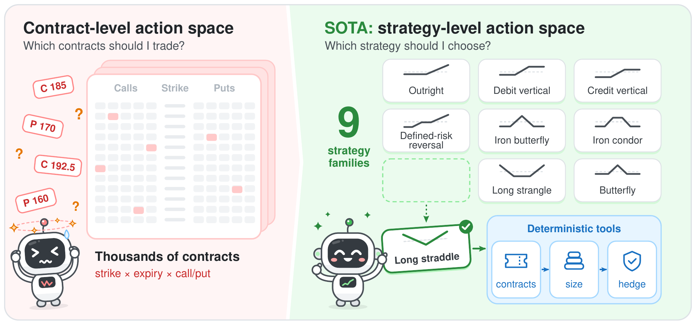

# SOTA: Stock Options Trading Agents Guided by Option-Implied Return Distributions

**Yizhen Xie · Mengyang Liu**

Carnegie Mellon University · Amazon

[Detailed documentation](docs/README.md) · [Citation](CITATION.cff)

## Abstract

As option markets grow and AI advances, agentic systems for option trading are gaining increasing attention. Language-model-based agents can reason over contextual information such as news, but option trading presents a particularly challenging decision problem: a single stock can have thousands of contracts, and the agent must decide both which contracts to trade and how to combine them. Existing approaches often sidestep this complexity by restricting the policy to a fixed strategy structure, such as a straddle, limiting their ability to switch strategies as market conditions change. We present SOTA (Stock Options Trading Agents), an agentic trading framework for structured option-strategy selection. SOTA abstracts the large option universe into strategy-level decisions while deterministic resolvers handle portfolio implementation. We develop SOTA by post-training Qwen3.8-27B with supervised fine-tuning followed by reinforcement learning. SOTA is evaluated on options on nine large-cap U.S. equities and SPY against rule-based and machine-learning strategy selectors in the same trading environment. Over a six-month out-of-sample period, SOTA earns an 18.3% total return with a Sharpe ratio of 1.60 and a maximum drawdown of 8.96%. We also document an asymmetric role of news: news improves frontier-teacher trajectories, but retaining news during reinforcement learning reduces out-of-sample return from 18.3% to −2.7%.

## Framework



*From contract-level to strategy-level decisions. Left: at the contract level, an agent must choose among thousands of listed contracts that differ in strike, expiry, and call/put type. Right: SOTA instead has the agent select one of nine option-strategy families and its parameters (here, a long straddle), and deterministic tools resolve that choice into exact contracts, a position size, and hedge trades.*

**SOTA learns which option strategy to trade.** Its nine strategy families express four kinds of exposure: **direction**, **volatility**, **skewness**, and **curvature**. The agent chooses the payoff shape; deterministic resolvers handle contracts, sizing, and hedging.

| Exposure | Strategy families |
| --- | --- |
| Direction | Outright (long call / put), debit vertical, credit vertical |
| Volatility | Long straddle, long strangle |
| Skewness | Defined-risk reversal |
| Curvature | Butterfly, iron butterfly, iron condor |

These groups illustrate economic exposures; individual strategies can span multiple exposures.

**Phase I — Supervised fine-tuning.** A frontier LLM generates trading trajectories from anonymized market states and contemporaneous news. Trajectories pass an outcome gate before the student learns from the teacher's decisions.

**Phase II — Reinforcement learning.** Portfolio rewards net of transaction costs refine the student policy. The reported RL configuration uses market states only.

## Reported results

Options on SPY and nine large-cap U.S. equities, evaluated out of sample from **March 3 to August 29, 2025**.

| Policy | Total return (%) | Sharpe ratio | Max. drawdown (%) |
| --- | ---: | ---: | ---: |
| SOTA | 18.32 | 1.60 | 8.96 |
| Equal-weighted rule | -5.22 | -13.46 | 5.22 |
| GARCH rule | -49.24 | -6.27 | 49.42 |
| Threshold rule | -28.46 | -1.95 | 33.16 |
| GBDT | -49.78 | -8.55 | 49.78 |
| Logistic | -55.45 | -11.63 | 55.47 |

SOTA uses Qwen3.8-27B after supervised fine-tuning and reinforcement learning. [Full metrics](results/table1.csv) · [Evaluation details](docs/README.md#results).

## Get started

```bash
git clone https://github.com/JenniceXie/sota-options-rl
cd sota-options-rl
pip install -e '.[chain]'
```

See the [detailed documentation](docs/README.md) for the repository structure, data, market-state and news pipelines, training, and installation options.

[Data layout](docs/data.md) · [Provenance](docs/provenance.md) · [Citation](CITATION.cff) · [MIT license](LICENSE)
