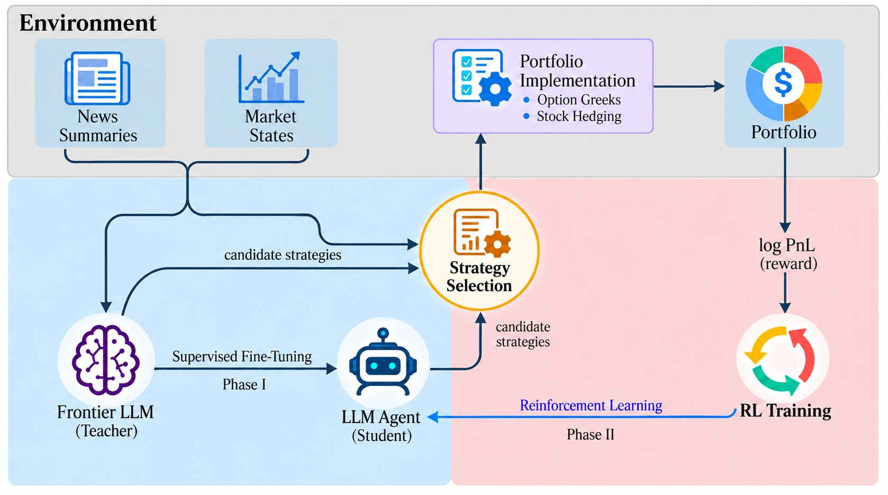

# SOTA: Stock Options Trading Agents Guided by Option-Implied Return Distributions

## Abstract

Agentic option trading requires an autonomous policy to select complex option strategies based on nuanced market conditions. We present SOTA (Stock Options Trading Agents), a language-model post-training framework for dynamic option strategy selection. SOTA represents market conditions using features of the option-implied return distribution and selects among nine structured option-strategy families. SOTA is first supervised on frontier-model trading trajectories and then optimized through reinforcement learning on portfolio performance. We evaluate SOTA on options on nine large-cap U.S. equities and SPY against non-LLM-based option strategy-selection, and demonstrate that SOTA achieves superior out-of-sample performance. We also find an asymmetric role of news: news improves frontier-teacher trajectories, but retaining news during reinforcement learning provides little additional benefit.

## Motivation

Option trading has expanded rapidly in recent years, with notional turnover
substantially exceeding that of the underlying equity market, particularly for
major index products and large-cap stocks. The adoption of AI-assisted and
agentic trading across financial platforms has created new opportunities for
agentic option trading. Options nest the directional return-prediction problem of
equities, and they also give targeted exposure to volatility, skewness and
curvature. Building an option strategy is hard, though. The investor must choose
from a large menu of contracts and combine them into positions with complex,
nonlinear payoffs.

SOTA trains a language model to make the economically interpretable decision:
which strategy family to trade, on which underlying, at which tenor and delta
coordinates. Contract selection, position sizing, portfolio implementation and
hedging are delegated to deterministic, rule-based resolvers. Training has two
stages. First, a frontier LLM generates trading decisions that supervise a
smaller language model. It sees structured market states and contemporaneous
news, with stock identity, absolute price levels and calendar time anonymized.
Reinforcement learning then refines the smaller model in a portfolio
environment, rewarding portfolio performance net of transaction costs.

Contributions:

* **A post-training framework for option trading.** The agent selects among a
  range of option-strategy families, trained by supervised fine-tuning and then
  reinforcement learning.
* **Point-in-time features for option strategy selection,** including features
  of the option-implied return distribution. A news pipeline uses contemporaneous
  news to construct frontier-model supervision while controlling the information
  available at each decision time.
* **A structured action space.** The language model issues high-level strategy
  decisions, and deterministic resolvers handle contract selection, position
  sizing, portfolio implementation and hedging. This keeps the decision problem
  small even though thousands of option contracts are available.
* **An asymmetric role of news across training stages.** News improves the
  frontier teacher's trading decisions, but retaining the news pipeline during
  reinforcement learning does not improve out-of-sample portfolio performance.



*Overview of the SOTA framework. A frontier LLM uses structured market states and
contemporaneous news to generate supervised trading trajectories. The smaller
language model is initialized through supervised fine-tuning and subsequently
optimized through reinforcement learning in the portfolio environment. The agent
selects option strategies and their parameters, while deterministic resolvers map
these decisions into executable portfolio positions.*

## Repository structure

```
src/portfolio_monkey/       the SOTA package (66 modules)
    env/                    trading environment: resolvers, costs, ledger, state encoding
        policy/             rule baselines, replay, LLM clients
    baselines/              the supervised per-strategy selectors (GBDT, Logistic)
    training/               corpus construction, reward, agent loop, veRL backend
    eval/                   NAV panel builders and the metric stack
    jobs/                   the episode runner
src/pm_train/               RL integration layer: agent loop, rollout session,
                            evaluation driver (10 modules)
scripts/
    rl/                     RL campaign entry points
    analysis/               baselines, oracle and results tables
configs/
    rl/                     SFT and RL command lines and agent-loop configurations
    baselines/              rule constants, fitted GARCH parameters, classifier metadata
    evaluation/             the resolved environment configuration
    dates_{sft,rl,eval}.txt the three date windows
examples/                   input schemas and a synthetic trajectory
results/                    results table and per-checkpoint metrics
tests/                      corpus-equivalence test and a concurrency benchmark
docs/                       data layout, provenance notes and the overview figure
```

## Results

| phase | dates | trading days |
| --- | --- | ---: |
| Supervised fine-tuning | 2024-09-03 to 2024-11-29 | 63 |
| Reinforcement learning | 2024-12-02 to 2025-02-28 | 59 |
| Test | 2025-03-03 to 2025-08-29 | 124 |

Test-window performance:

| policy | TR (%) | ASR | ACR | ASoR | AVOL (%) | MDD (%) | WR (%) | PLR |
| --- | ---: | ---: | ---: | ---: | ---: | ---: | ---: | ---: |
| SOTA | 18.32 | 1.60 | 4.59 | 4.77 | 21.52 | 8.96 | 29.17 | 4.68 |
| Equal-weighted rule | −5.22 | −13.46 | −1.98 | −11.54 | 0.81 | 5.22 | 31.11 | 1.08 |
| GARCH rule | −49.24 | −6.27 | −1.52 | −6.25 | 22.17 | 49.42 | 29.85 | 0.75 |
| Threshold rule | −28.46 | −1.95 | −1.50 | −3.50 | 35.20 | 33.16 | 41.31 | 1.89 |
| GBDT | −49.78 | −8.55 | −1.52 | −8.18 | 16.51 | 49.78 | 24.07 | 1.23 |
| Logistic | −55.45 | −11.63 | −1.46 | −9.70 | 14.24 | 55.47 | 20.42 | 1.00 |

SOTA is Qwen3.8-27B after supervised fine-tuning and then reinforcement learning
on market states only, at RL step 20. TR is total return. ASR, ACR and ASoR are
the annualized Sharpe, Calmar and Sortino ratios. AVOL is annualized volatility
and MDD is maximum drawdown. WR is the fraction of completed trades with positive
profit, and PLR is the average profit of winning trades relative to the average
loss of losing trades.

The baselines:

* **Equal-weighted rule:** equal weight across 140 fixed-strategy arms, one per
  strategy family and orientation on each underlying at 8–30 days to expiry,
  rebalanced daily.
* **GARCH rule:** sells volatility through an iron condor when implied
  volatility is at least 25% above a GARCH(1,1) forecast fitted before the test
  window. It buys volatility through a long straddle when implied volatility is
  at least 10% below the forecast.
* **Threshold rule:** one fixed threshold on one scale-free market feature for
  each of the nine strategy families.
* **GBDT and Logistic:** one classifier per strategy family and orientation,
  trained on the supervised window to predict whether a position can be closed
  at a profit. A position is opened when its predicted probability exceeds both
  0.5 and that strategy's base rate in training.

Row-level detail is in [`results/table1.csv`](results/table1.csv). Per-checkpoint
training reward and test metrics are in
[`results/rl_training_metrics.csv`](results/rl_training_metrics.csv).

## Data

The study covers options on SPY and nine large-cap U.S. equities (AAPL, AMZN,
GOOGL, META, MSFT, MU, NVDA, PLTR and TSLA) over 246 trading dates, from
2024-09-03 to 2025-08-29. The inputs are daily point-in-time partitions,
`features/<dataset>/date=<YYYY-MM-DD>/part-*`:

| dataset | content |
| --- | --- |
| `option_chain_snapshots` | per-contract NBBO and greeks (parquet) |
| `option_iv_surface_features` | implied-volatility level, term slope, skew and curvature |
| `option_delta_point_surface` | implied volatility at delta points |
| `option_open_interest_features` | open interest and its change |
| `compact_option_flow_states` | option flow imbalance |
| `underlying_market_features` | underlying returns and realized volatility |
| `news_catalyst_rows` | summarized news items |

Example schemas:

* [`examples/market_state_schema.json`](examples/market_state_schema.json) — the
  per-step market state and the action grammar
* [`examples/news_schema.json`](examples/news_schema.json) — a news item
* [`examples/sft_trajectory_schema.json`](examples/sft_trajectory_schema.json) — a
  supervised trajectory record, with a synthetic instance in
  [`examples/synthetic_sft_example.jsonl`](examples/synthetic_sft_example.jsonl)

For example, a news item (synthetic):

```json
{"underlying": "U03", "category": "ea", "direction": "+", "horizon": 3,
 "text": "U03 reported quarterly results above consensus; management raised full-year guidance.",
 "available_at": "2025-06-12T20:15:00Z"}
```

## Pipeline

### Market states

**Sources.** Option trades and quotes from OPRA, and OptionMetrics. Underlying
stock prices are CRSP daily open and close prices for the nine equities, and
SpiderRock underlying marks for SPY.

**Variables.** For each underlying and trading date $t$, the state has ten
features. Write $S_t$ for the underlying price and $r_i$ for a daily
close-to-close log return. Write $\sigma^{\mathrm{iv}}_t(\delta,\tau)$ for the
implied volatility at delta coordinate $\delta$ and $\tau$ calendar days to
expiry. Volatilities are annualized.

| feature | name | definition |
| --- | --- | --- |
| `ret` | return | $\log(S_t/S_{t-1})$, the underlying's log return over the session |
| `rv` | realized volatility | $\sqrt{\tfrac{252}{21}\sum_{i=1}^{21} r_{t-i}^{2}}$, zero-mean estimator over the trailing 21 trading days |
| `iv` | implied volatility | $\sigma^{\mathrm{iv}}_t(0.50\mathrm{C},30)$, the at-the-money call with 30 days to expiry |
| `dv` | change in implied volatility | $\mathrm{iv}_t-\mathrm{iv}^{\mathrm{open}}_t$, from the market open to the close |
| `w` | volatility wedge | $\mathrm{iv}_t-\mathrm{rv}_t$ |
| `ts` | term structure | $\sigma^{\mathrm{iv}}_t(0.50\mathrm{C},90)-\sigma^{\mathrm{iv}}_t(0.50\mathrm{C},30)$ |
| `sk` | skewness | $\sigma^{\mathrm{iv}}_t(0.25\mathrm{P},30)-\sigma^{\mathrm{iv}}_t(0.25\mathrm{C},30)$ |
| `bf` | curvature | $\tfrac{1}{2}\left[\sigma^{\mathrm{iv}}_t(0.25\mathrm{P},30)+\sigma^{\mathrm{iv}}_t(0.25\mathrm{C},30)\right]-\mathrm{iv}_t$, the 30-day 25-delta butterfly |
| `fi` | option flow imbalance | $\sum_k q_k\,\mathrm{sign}_k\lvert\Delta_k\rvert \,/\, \sum_k q_k\lvert\Delta_k\rvert$ over option trades $k$ printed between the session open and the decision, with $\mathrm{sign}_k$ the inferred trade direction |
| `doi` | change in open interest | $(\mathrm{OI}_t-\mathrm{OI}_{t-1})/\mathrm{OI}_{t-1}$ |

**Point in time.** Each raw or derived record carries three timestamps: when the
underlying economic event occurred, when the information became available, and
when the pipeline ingested it. A record enters the state for date $t$ only if it
was available by $t$. The rule applies recursively to derived features as well
as to raw data.

### News

**Sources.** News from Massive.com's news API, and regulatory filings from SEC
EDGAR.

**Summarization and verification.** A language model summarizes each document
into a short, source-grounded summary, labelled with a catalyst category, a
direction and an expected horizon. A second, independent judge model verifies
every summary against its source document. It checks numerical levels against
changes, fiscal periods, dated events, unsupported causal claims, omitted
material facts, and the direction and horizon labels, and it refines any
summary the source does not support. Numerical and date claims are also checked
deterministically against the source, and items that fail are quarantined. Each
item keeps the time at which it became available, and it can enter a state only
from that time on.

**Leakage prevention.** Stock identity, stock price and calendar time are
anonymized in everything the language model sees, and the time-series
structure is preserved.

* Identity: tickers are replaced by labels (U01–U10) that are redrawn every
  episode, and other company names in news text are masked.
* Price: no price level or spot quote is shown; the market state carries
  returns, volatilities and other relative quantities.
* Calendar time: dates and years are masked. Time is given as the number of days
  to the standard monthly expiration.
* Preserved: each episode is one calendar month of consecutive trading days
  observed in order, so returns, volatilities and news keep their sequence.

### Training

**Supervised trajectories.** A frontier teacher runs the full environment over
the supervised window, through the same harness the policy is evaluated in,
producing one trajectory per month-long episode. Trajectories must pass an
**outcome gate** before any token is trained on: a threshold on the risk-adjusted
return and drawdown of the whole trajectory, not of individual decisions.
Episodes exceeding the token budget are dropped at corpus-build time.
`src/portfolio_monkey/training/selection.py` and `measure.py` implement the gate;
`corpus.py` writes the records.

**Supervised fine-tuning.** Full fine-tuning of the student on the gated corpus,
with the loss masked to assistant turns only. The mask matters: the state block
is one to two orders of magnitude longer than the completion, so an unmasked
objective would mostly train the model to copy the prompt. Settings are in
`configs/rl/cfg_sys_sft.txt` and `cmd_sys_sft.sh`.

**Reinforcement learning.** GRPO against the live environment, with no learned
value function and no reward model.

*Episode.* An episode is one calendar month of the RL window, with one decision
per trading day. It starts from a fresh portfolio whose initial value $V_0$ is
USD 1,000,000. The RL window, 2024-12-02 to 2025-02-28, holds three episodes.

*Objective.* The per-step reward is the change in log portfolio value, net of
transaction costs. The policy maximizes the reward's discounted sum over the
episode:

$$
r_t = \log V_{t+1} - \log V_t ,
\qquad
\max_{\theta}\; \mathbb{E}_{\tau\sim\pi_{\theta}}\Big[\sum_{t=0}^{T-1}\gamma^{t}\, r_t\Big],
\qquad \gamma = 0.99 .
$$

For each episode the policy samples a group of $G = 8$ rollouts. Each rollout's
return is standardized within its group: the group mean is subtracted and the
result divided by the group standard deviation. That advantage is assigned to
every token the policy generated in the rollout, and environment observations
are masked from the loss. The update maximizes the clipped policy-gradient
surrogate (clip ratio 0.2), averaged over generated tokens, minus a KL penalty
to the supervised policy with coefficient 0.01.

`src/pm_train/` is the integration layer. `episode.py` and `procsession.py` run
the environment behind the trainer, `verl_loop.py` is the agent loop,
`reward_shim.py` exposes the trajectory-level reward, and `evaluate.py` produces
the metrics. `scripts/rl/campaign27.py` drives the reported campaign.

## Installation

```bash
git clone https://github.com/JenniceXie/sota-options-rl
cd sota-options-rl
pip install -e '.[chain]'
```

Optional extras: `baselines` for the GBDT and Logistic baselines, and `dev` for
the tests. RL training additionally uses veRL 0.7.1 and vLLM 0.11.0.

## Citation

See [`CITATION.cff`](CITATION.cff).

## License

The code is under the MIT License. The datasets used in this study are
proprietary.
