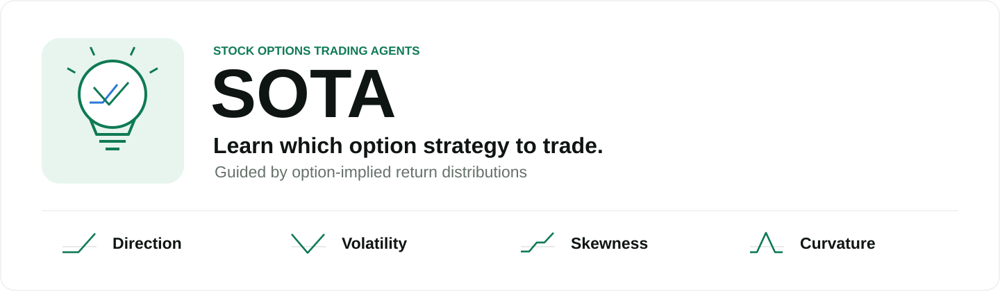
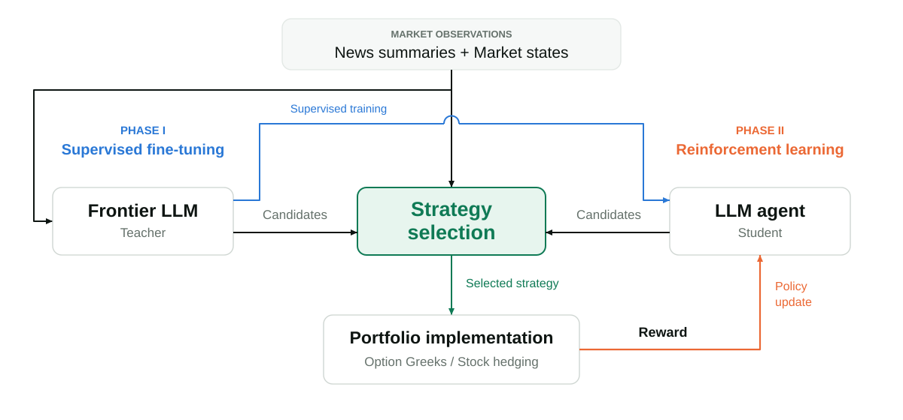
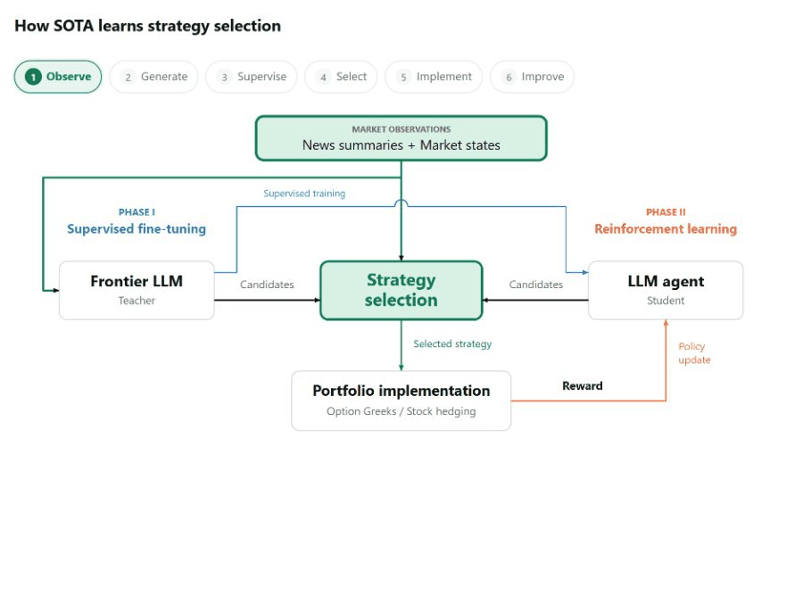

# SOTA: Stock Options Trading Agents Guided by Option-Implied Return Distributions

**Yizhen Xie · Mengyang Liu**

Carnegie Mellon University · Amazon

[Detailed documentation](docs/README.md) · [Interactive walkthrough](docs/PROJECT_PAGE.md) · [Citation](CITATION.cff)

**SOTA learns which option strategy to trade.** Its nine strategy families express four kinds of exposure: **direction**, **volatility**, **skewness**, and **curvature**. The agent chooses the payoff shape; deterministic resolvers handle contracts, sizing, and hedging.

| Exposure | Strategy families |
| --- | --- |
| Direction | Outright (long call / put), debit vertical, credit vertical |
| Volatility | Long straddle, long strangle |
| Skewness | Defined-risk reversal |
| Curvature | Butterfly, iron butterfly, iron condor |

These groups illustrate economic exposures; individual strategies can span multiple exposures.

## Framework



**Phase I — Supervised fine-tuning.** A frontier LLM generates trading trajectories from anonymized market states and contemporaneous news. Trajectories pass an outcome gate before the student learns from the teacher's decisions.

**Phase II — Reinforcement learning.** Portfolio rewards net of transaction costs refine the student policy. The reported RL configuration uses market states only.

### Strategy selection in action



The animation highlights each stage and expands strategy selection into the four exposure groups. [Open or run the interactive version](docs/PROJECT_PAGE.md) for play/pause and step controls. [Download the static figure](docs/sota_framework.svg).

## Reported results

Options on SPY and nine large-cap U.S. equities, evaluated out of sample from **March 3 to August 29, 2025**.

| Policy | Total return (%) | Sharpe ratio | Max. drawdown (%) |
| --- | ---: | ---: | ---: |
| SOTA | 18.32 | 1.60 | 8.96 |
| Equal-weighted rule | -5.22 | -13.46 | 5.22 |
| GARCH rule | -49.24 | -6.27 | 49.42 |
| Threshold rule | -28.46 | -1.95 | 33.16 |
| GBDT | -49.78 | -8.55 | 49.78 |
| Logistic | -55.45 | -11.63 | 55.47 |

SOTA uses Qwen3.8-27B after supervised fine-tuning and reinforcement learning. [Full metrics](results/table1.csv) · [Evaluation details](docs/README.md#results).

## Get started

```bash
git clone https://github.com/JenniceXie/sota-options-rl
cd sota-options-rl
pip install -e '.[chain]'
```

See the [detailed documentation](docs/README.md) for the repository structure, data, market-state and news pipelines, training, and installation options.

[Data layout](docs/data.md) · [Provenance](docs/provenance.md) · [Citation](CITATION.cff) · [MIT license](LICENSE)
